# 实验1


## 写在前面

本次实验主要在`Jupyter book`上用`Pytorch`实现，并对实验指导书的公式进行了一些调整，如下：

我采用了和实验指导书不一样的x，我将新添加的列放在了原来x的后面，即：
$$
X = 
\begin{bmatrix}
x_1^T&1\\
x_2^T&1\\
\vdots&\vdots\\
x_m^T&1
\end{bmatrix}
$$
则原本的参数$\omega$ 变为
$$
\hat\omega = [\omega;b]
$$
模型为：
$$
\hat y = X\hat\omega
$$
损失函数：
$$
E_{\hat\omega} = (y - X\hat\omega)^T(y-X\hat\omega)
$$
则损失函数相对于参数的导数为：
$$
\frac{\partial E_\hat\omega}{\partial\hat\omega} = 2X^T(X\hat\omega-y)
$$
梯度下降方法为：
$$
\hat\omega\leftarrow \hat\omega-\alpha\frac{1}{m}\frac{\partial E_\hat\omega}{\partial\hat\omega}
$$


其中，$\alpha$为学习率。

由于Pytorch与MATLAB不同，因此实验指导书中的许多代码没法直接使用，具体如下：

## 1 头文件

```py
import torch
import torch.nn as nn
import torch.optim as optim
import numpy as np
import matplotlib.pyplot as plt
```


## 2 加载数据

```py
# 加载数据
x = torch.tensor(np.loadtxt('ex1x.dat'), dtype=torch.float32)
y = torch.tensor(np.loadtxt('ex1y.dat'), dtype=torch.float32)
x0 = x  # 保存初始的x
plt.plot(x, y, 'o')
plt.ylabel("Height in meters") 
plt.xlabel("Age in years")
```

结果：

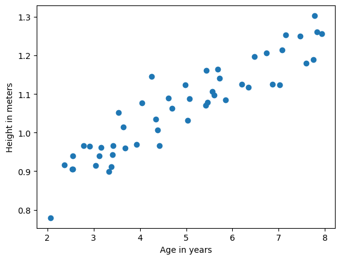

此时输出x与y后发现，二者均为一维数组，不满足题意，因此修改如下：

```py
print(f'x:{x}\n')
print(f'y:{y}\n')
```

```
x:tensor([2.0659, 2.3684, 2.5400, 2.5421, 2.5491, 2.7867, 2.9117, 3.0356, 3.1147,
        3.1582, 3.3276, 3.3793, 3.4122, 3.4216, 3.5316, 3.6393, 3.6733, 3.9256,
        4.0499, 4.2483, 4.3440, 4.3827, 4.4231, 4.6102, 4.6881, 4.9777, 5.0360,
        5.0685, 5.4161, 5.4396, 5.4563, 5.5698, 5.6016, 5.6878, 5.7216, 5.8539,
        6.1978, 6.3511, 6.4797, 6.7384, 6.8638, 7.0223, 7.0782, 7.1514, 7.4664,
        7.5974, 7.7441, 7.7730, 7.8265, 7.9306])

y:tensor([0.7792, 0.9160, 0.9054, 0.9057, 0.9390, 0.9668, 0.9644, 0.9145, 0.9393,
        0.9607, 0.8984, 0.9121, 0.9424, 0.9662, 1.0526, 1.0144, 0.9597, 0.9685,
        1.0766, 1.1455, 1.0341, 1.0070, 0.9668, 1.0896, 1.0634, 1.1237, 1.0323,
        1.0874, 1.0703, 1.1606, 1.0778, 1.1070, 1.0972, 1.1649, 1.1412, 1.0844,
        1.1252, 1.1168, 1.1971, 1.2069, 1.1251, 1.1236, 1.2133, 1.2523, 1.2497,
        1.1800, 1.1897, 1.3030, 1.2601, 1.2562])
```


修改后：

```py
# m = y.size(0)
# print(m)
# 变为列向量
x = x.reshape(-1, 1)
y = y.reshape(-1, 1)
print(x)
print(y)
```

结果：

```
tensor([[2.0659],
        [2.3684],
        [2.5400],
        [2.5421],
        [2.5491],
        [2.7867],
        [2.9117],
        [3.0356],
        [3.1147],
        [3.1582],
        [3.3276],
        [3.3793],
        [3.4122],
        [3.4216],
        [3.5316],
        [3.6393],
        [3.6733],
        [3.9256],
        [4.0499],
        [4.2483],
        [4.3440],
        [4.3827],
        [4.4231],
        [4.6102],
        [4.6881],
        [4.9777],
        [5.0360],
        [5.0685],
        [5.4161],
        [5.4396],
        [5.4563],
        [5.5698],
        [5.6016],
        [5.6878],
        [5.7216],
        [5.8539],
        [6.1978],
        [6.3511],
        [6.4797],
        [6.7384],
        [6.8638],
        [7.0223],
        [7.0782],
        [7.1514],
        [7.4664],
        [7.5974],
        [7.7441],
        [7.7730],
        [7.8265],
        [7.9306]])
tensor([[0.7792],
        [0.9160],
        [0.9054],
        [0.9057],
        [0.9390],
        [0.9668],
        [0.9644],
        [0.9145],
        [0.9393],
        [0.9607],
        [0.8984],
        [0.9121],
        [0.9424],
        [0.9662],
        [1.0526],
        [1.0144],
        [0.9597],
        [0.9685],
        [1.0766],
        [1.1455],
        [1.0341],
        [1.0070],
        [0.9668],
        [1.0896],
        [1.0634],
        [1.1237],
        [1.0323],
        [1.0874],
        [1.0703],
        [1.1606],
        [1.0778],
        [1.1070],
        [1.0972],
        [1.1649],
        [1.1412],
        [1.0844],
        [1.1252],
        [1.1168],
        [1.1971],
        [1.2069],
        [1.1251],
        [1.1236],
        [1.2133],
        [1.2523],
        [1.2497],
        [1.1800],
        [1.1897],
        [1.3030],
        [1.2601],
        [1.2562]])
```


## 3 修改x


```py
m = y.size(0)
# print(m)
new_colunm = torch.ones(m).reshape(-1,1)
# print(new_colunm)
x = torch.cat((x, new_colunm), dim=1)
print(x)
```

结果：

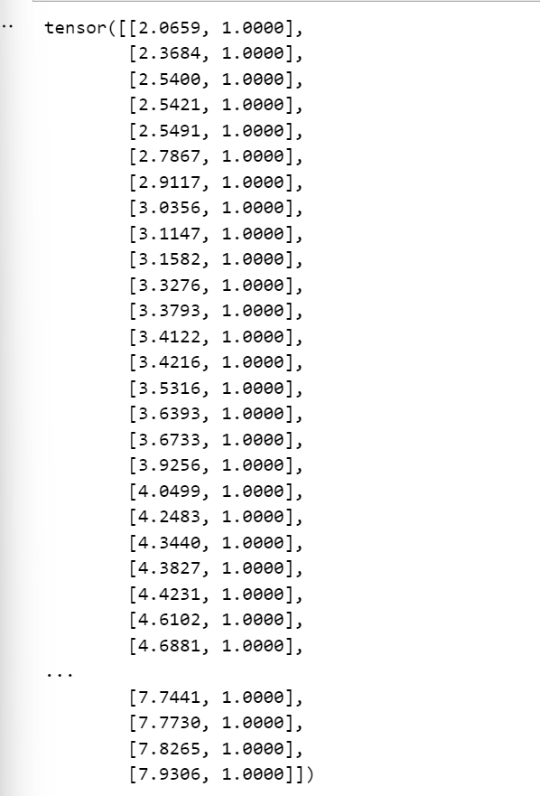

## 4 初始化参数

```py
# 初始化模型参数: xw
# w = torch.normal(0, 0.01, size=(2, 1), requires_grad=True)
w = torch.zeros(2, 1, requires_grad=True)  # 按照题目要求初始化为0
print(w[0][0])
print(w[1][0])
print(type(w))
print(w)
```

结果：

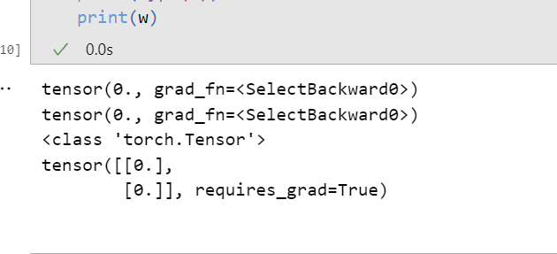

## 5 定义模型

```py
batch_size = 50  # 每次训练都遍历整个数据集

# 定义模型
def LinearRegession(X, w):
    return torch.matmul(X, w)
```


## 6 定义损失函数

```py
# 定义损失函数
def squared_loss(y_hat, y):
    return (y_hat - y.reshape(y_hat.shape)) **2 /2
```


## 7 定义梯度下降算法

```py
# 定义梯度下降算法
def GD(params, alpha, batch_size=50):
    """
    分别为 参数，学习率，批量大小 
    """
    with torch.no_grad():
        for param in params:
            param -= alpha * param.grad / batch_size
            param.grad.zero_()
```


## 8 训练

```py
# 初始化训练参数
alpha = 0.07
num_epochs = 1500

for epoch in range(num_epochs):
    loss = squared_loss(LinearRegession(x, w), y)   # 此处loss为m维的tensor，应该先求和再反向传播
    # print(f'第{epoch + 1}轮：loss：{loss}\n')  
    loss = loss.sum() 
    loss.backward()
    print(f'第{epoch + 1}轮：loss：{loss}\n') 
    # 更新梯度
    GD(w, alpha=alpha, batch_size=50)
```

这段代码运行时候，会出现一个报错：

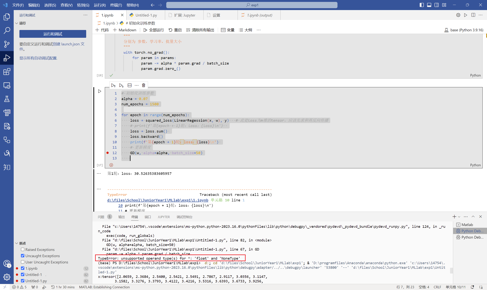

经过定位，发现是这个函数出现了问题：

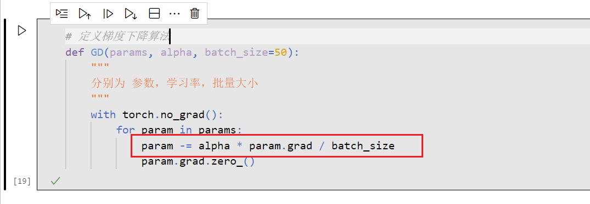

提示是，乘号无法让float和NoneType进行运算，为什么会出现NoneType呢？

经过反复调试：

此时的param是一个tensor：

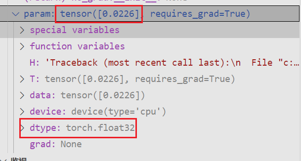


而我们这么修改：

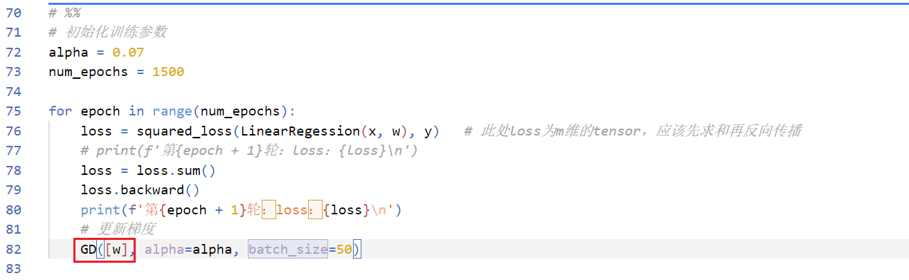

结果param变成了这个：

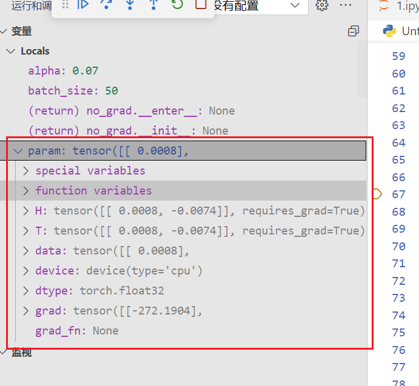

然后就能正常运行了。

**为啥？**

因为

```py
for param in params:
```

这句，如果传入的是`w`，那`param`是`w[0]`和`w[1]`，而他们是没有梯度的，有梯度的是整个`w`, 因此这么写需要修改训练代码。

修改后的训练代码：

```py
# 初始化训练参数
alpha = 0.07
num_epochs = 1500

xx = [i for i in range(1, 1500 + 1)]
yy = []
w0first_w = w[0].tolist()
w1first_b = w[1].tolist()

w0final_w = w[0].tolist()
w1final_b = w[1].tolist()

for epoch in range(num_epochs):
    loss = squared_loss(LinearRegession(x, w), y)   # 此处loss为m维的tensor，应该先求和再反向传播
    # print(f'第{epoch + 1}轮：loss：{loss}\n')  
    loss = loss.sum() 
    loss.backward()
    print(f'第{epoch + 1}轮：loss：{loss}\n') 
    a = loss.tolist()
    yy.append(a)
    # 更新梯度
    GD([w], alpha=alpha, batch_size=50)  # Hear！！
    # record the value of w0 and w1:
    if epoch == 0:
        w0first_w = w[0]
        w1first_b = w[1]

w0final_w = w[0].tolist()
w1final_b = w[1].tolist()
    
# 绘制loss的图像：
plt.plot(xx, yy)
plt.ylabel(loss)
plt.xlabel(epoch)

print(f'w0first_w: {w0first_w}\n')
print(f'w1first_b: {w1first_b}\n')
print(f'w0final_w: {w0final_w}\n')
print(f'w1final_b: {w1final_b}\n')
```

结果：

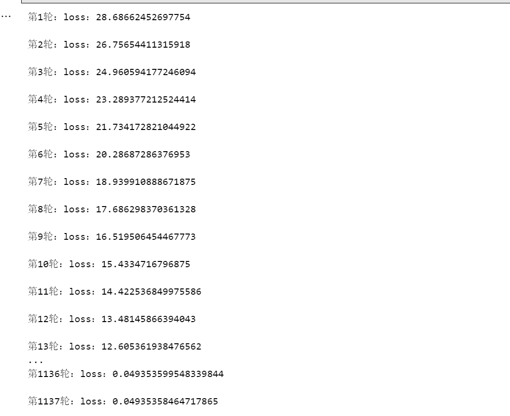

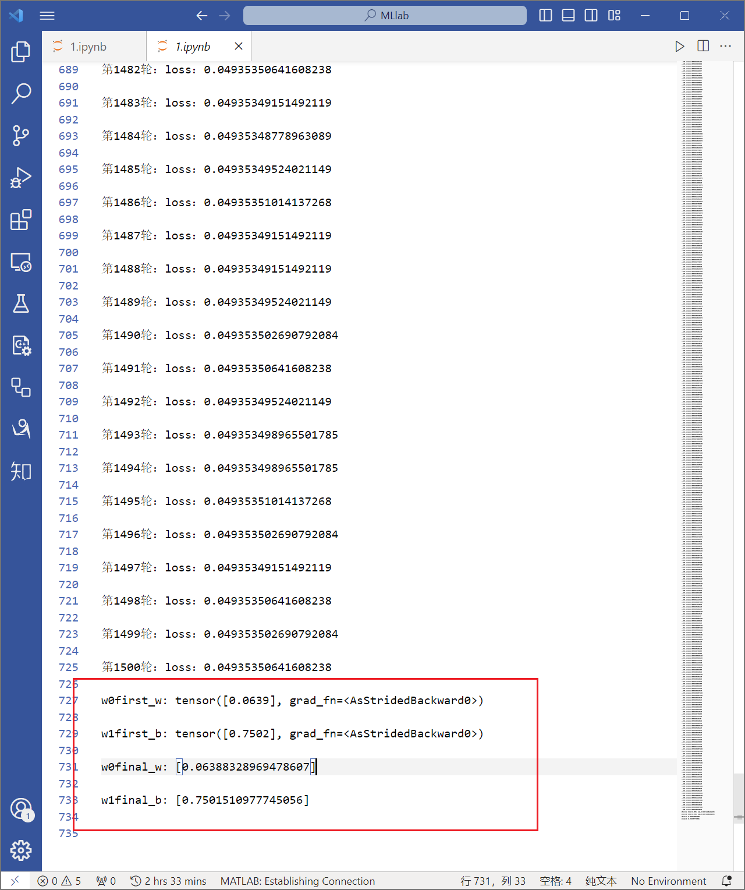

可以发现最终收敛。

误差的变化：

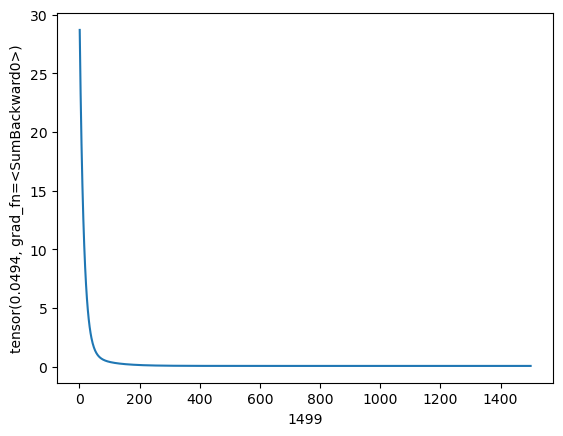

可以发现在接近200轮左右就接近收敛了。

## 运行结果

### 一次梯度下降得到的参数：

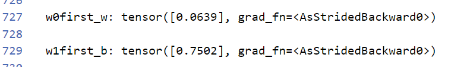

### 最终得到的参数：

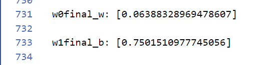

对比可以发现，用`pytorch`训练是非常高效的

### 绘制对应的Linear函数

```py
print(type(w0final_w[0]))   # list转为float
def outcome(x):
    return w0final_w[0] * x + w1final_b[0]
yfinal = []
for _ in x0:
    yfinal.append(outcome(_.tolist()))
    
plt.plot(x0, y, 'o')
plt.plot(x0, yfinal)
plt.legend(["Traing data","Linear regression"])
plt.ylabel("Height in meters") 
plt.xlabel("Age in years")
```

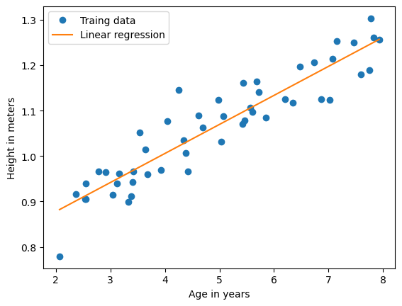

可以发现参数学习的非常完美。

## 预测

```py
# 预测
x1 = 3.5
x2 = 7
y1 = outcome(x1)
y2 = outcome(x2)

print(f'the height for the boy of ages 3.5: {y1}\n')
print(f'the height for the boy of ages 7: {y2}\n')
```

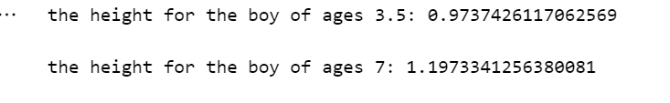

## 绘制$J_{\theta}与\theta$的关系图

由：
$$
J_{\theta} = \frac{1}{2|m|}E_{\hat\omega}
$$
其中：
$$
E_{\hat\omega} = (y - X\hat\omega)^T(y-X\hat\omega)
$$
则代码：

```m
% 导入数据
x = load('ex1x.dat');
y = load('ex1y.dat');
m=length(y);%store the number of training examples
x=[ones(m,1) x];%add column of ones to x

J_vals = zeros(100, 100);
theta0_vals = linspace(-3, 3, 100);
theta1_vals = linspace(-1, 1, 100);
for i = 1 :length(theta0_vals)
    for j = 1:length(theta1_vals)
        t = [theta0_vals(i); theta1_vals(j)];
        J_vals(i, j) = 1/(2 * m) * (x * t - y)' * (x * t - y);
    end
end

J_vals = J_vals'

figure;
surf(theta0_vals, theta1_vals, J_vals)
xlabel('\theta_0');
ylabel('\theta_1')

figure;
contour(theta0_vals, theta1_vals, J_vals, logspace(-3, 3, 20))
xlabel('\theta_0'); ylabel('\theta_1')
```


此处用的MATLAB进行绘图：

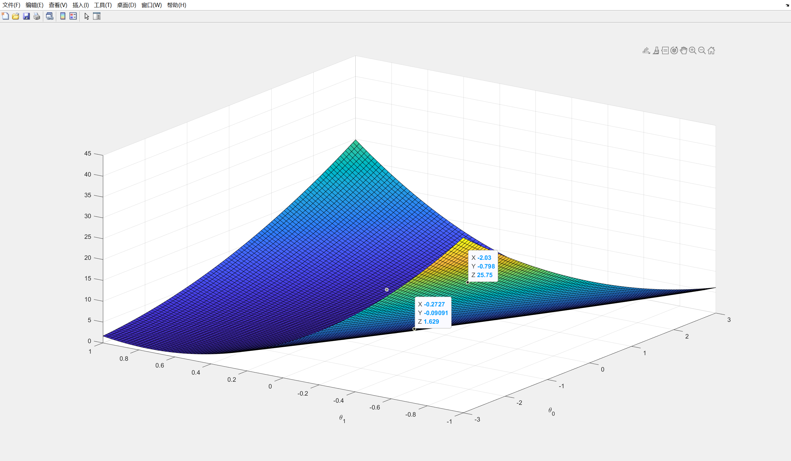

等高线图：

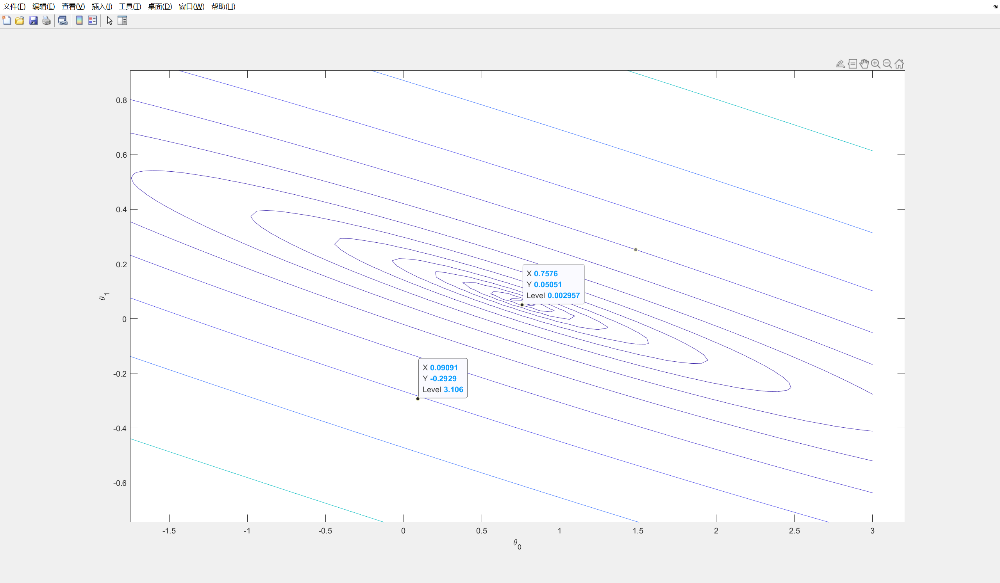

## 思考

通过本实验，进一步加深了`pytorch`的使用，同时借助实验指导书也学习了MATLAB在人工智能中的应用。自己推导了线性回归和梯度下降，对机器学习的认识更加深入了。


