# 写在前面

本实验仍然采用`pytorch`实现。其中与实验1一样，对实验指导书中对x的处理做了一些改变，并对实验指导书的公式进行了一些调整，如下：

我采用了和实验指导书不一样的x，我将新添加的列放在了原来x的后面，即：
$$
X = 
\begin{bmatrix}
x_{11}^T&x_{12}^T&1\\
x_{21}^T&x_{22}^T&1\\
\vdots&\vdots&\vdots\\
x_{m1}^T&x_{m2}^T&1
\end{bmatrix}
$$
则原本的参数$\omega$ 变为
$$
\hat\omega = [\omega;b]
$$
模型为：
$$
\hat y = X\hat\omega
$$
损失函数：
$$
E_{\hat\omega} = (y - X\hat\omega)^T(y-X\hat\omega) / 2
$$
则损失函数相对于参数的导数为：
$$
\frac{\partial E_\hat\omega}{\partial\hat\omega} = 2X^T(X\hat\omega-y)
$$
梯度下降方法为：
$$
\hat\omega\leftarrow \hat\omega-\alpha\frac{1}{m}\frac{\partial E_\hat\omega}{\partial\hat\omega}
$$


其中，$\alpha$为学习率。

由于Pytorch与MATLAB不同，因此实验指导书中的许多代码没法直接使用，具体如下：

# 1 导入头文件

```py
import torch
import torch.nn as nn
import torch.optim as optim
import numpy as np
import matplotlib.pyplot as plt
```

# 2 导入数据

```py
# 加载数据
x = torch.tensor(np.loadtxt('ex2x.dat'), dtype=torch.float32)
y = torch.tensor(np.loadtxt('ex2y.dat'), dtype=torch.float32)
```

# 3 调整数据的结构

```py
# x = x.reshape(-1, 1)
y = y.reshape(-1 ,1)
print(x)
print(y)
print(x.shape)
print(y.shape)
```

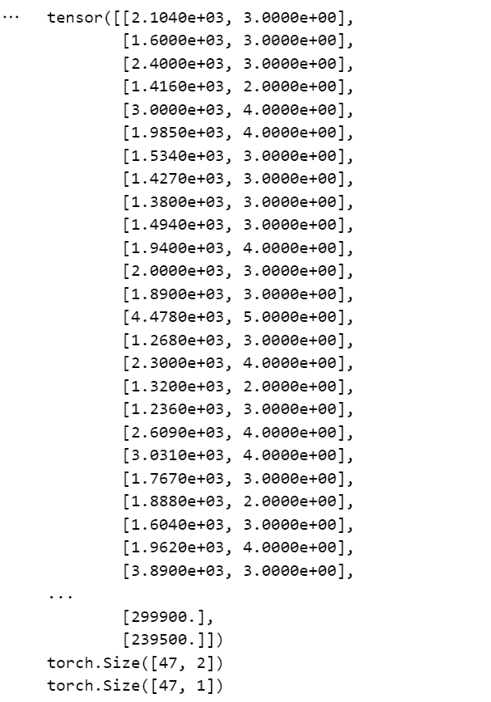

# 4 为x添加新列

```py
# 为x新添加一列，放在最后
m = x.size(0)
print(m)
new_colunm = torch.ones(m).reshape(-1, 1)
x = torch.cat((x, new_colunm), dim = 1)
print(x)
```

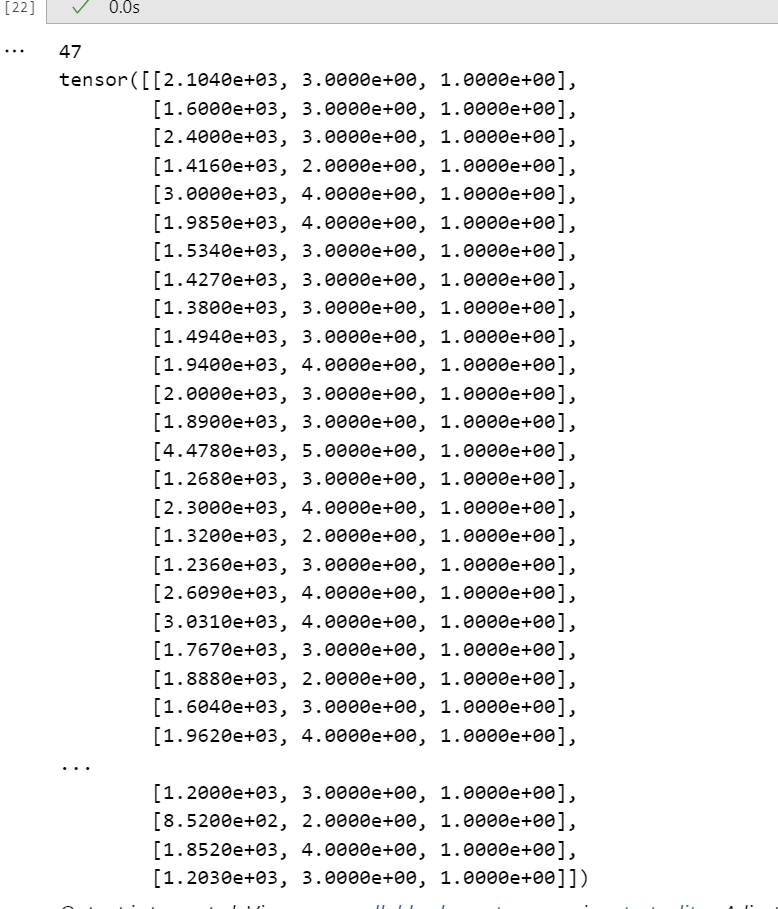

# 5 标准化x

```py
# 
# 计算均值和标准差
mu = x.mean(dim=0)
sigma = x.std(dim=0)

# 标准化第0列和第1列
x[:, 0] = (x[:, 0] - mu[0]) / sigma[0]
x[:, 1] = (x[:, 1] - mu[1]) / sigma[1]
print(x)
```

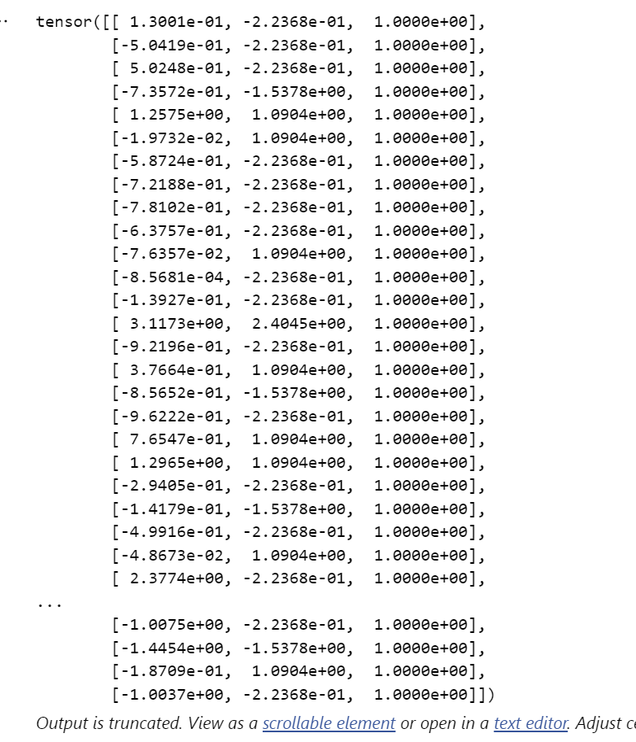

# 6 初始化参数矩阵

```py
# 初始化模型参数: xw
w = torch.zeros(3, 1, requires_grad=True)  # 按照题目要求初始化为0
print(w[0][0])
print(w[1][0])
print(w[2])
print(type(w))
print(w)
```

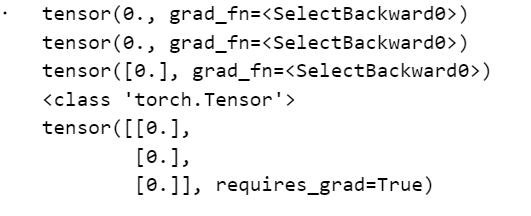

# 7 定义模型

```py
# def the model
batch_size = m

def LinearRegession(X, w):
    return torch.matmul(X, w)
```

# 8 定义损失函数

```py
# def the loss or J(θ)
def Jθ(y_hat, y):
    return (y_hat - y.reshape(y_hat.shape)) **2 /(2 * m)
```

其中，
$$
J_{\theta} =E_{\hat\omega} = (y - X\hat\omega)^T(y-X\hat\omega) / 2
$$

# 9 定义梯度下降算法

```py
# 定义梯度下降算法
def GD(params, alpha):
    """
    分别为 参数，学习率，批量大小 
    """
    with torch.no_grad():
        for param in params:
            param -= alpha * param.grad
            param.grad.zero_()
```


# 10 训练

```py
num_epochs = 50
def train(alpha):
    """返回此alpha下Jθ的变化, 训练一次后的w，训练结束后的w"""
    # 初始化训练参数
    

    # xx = [i for i in range(1, 50 + 1)]
    yy = []

    wfirst = w
    wfinal = w
    
    for epoch in range(num_epochs):
        loss = Jθ(LinearRegession(x, w), y)   # 此处loss为m维的tensor，应该先求和再反向传播
        # print(f'第{epoch + 1}轮：loss：{loss}\n')  
        loss = loss.sum() 
        loss.backward()
        print(f'第{epoch + 1}轮：loss：{loss}\n') 
        a = loss.tolist()
        yy.append(a)
        # 更新梯度
        GD([w], alpha)  # Hear！！
        # record the value of w0 and w1:
        if epoch == 0:
            wfirst = w
            
    wfinal = w

    return yy, wfirst, wfinal
```

**此处训练代码有误，正确的如下：**

在进行训练时候，犯了一个错误，忘记了pytorch对tensor进行复制时候，默认的是浅复制，也就是二者共用一块内存，而为了能够在不同的学习率下进行训练，应该进行深复制，因此对training的修改如下：

```py
import copy
num_epochs = 50

def train(alpha):
    """返回此alpha下Jθ的变化, 训练一次后的w，训练结束后的w"""
    # 初始化训练参数
    

    # xx = [i for i in range(1, 50 + 1)]
    yy = []
    # wthis = w
    wthis = copy.deepcopy(w)  # 注意要深复制
    # print(wthis)
    wfirst = wthis
    wfinal = wthis
    
    for epoch in range(num_epochs):
        loss = Jθ(LinearRegession(x, wthis), y)   # 此处loss为m维的tensor，应该先求和再反向传播
        # print(f'第{epoch + 1}轮：loss：{loss}\n')  
        loss = loss.sum() 
        loss.backward()
        # print(f'第{epoch + 1}轮：loss：{loss}\n') 
        a = loss.tolist()
        yy.append(a)
        # 更新梯度
        GD([wthis], alpha, m)  # Hear！！
        # record the value of w0 and w1:
        if epoch == 0:
            wfirst = wthis
            
    wfinal = wthis

    return yy, wfirst, wfinal
```


```py
a1 = 0.01
a2 = 0.03
a3 = 0.1
a4 = 0.3
a5 = 0.6
a6 = 1.
a7 = 1.3
a8 = 1.32
a9 = 1.33


J1, w1first, w1final = train(a1)
J2, w2first, w2final = train(a2)
J3, w3first, w3final = train(a3)
J4, w4first, w4final = train(a4)
J5, w5first, w5final = train(a5)
J6, w6first, w6final = train(a6)
J7, w7first, w7final = train(a7)
J8, w8first, w8final = train(a8)
J9, w9first, w9final = train(a9)
```

绘图：

```py
# 绘图
def draw(yy, ti):
    xx = [i for i in range(1, num_epochs + 1)]
    plt.plot(xx, yy)
    plt.title(ti)
    plt.ylabel("loss")
    plt.xlabel("epoch")
    plt.show()
```


## 10.1 $\alpha = 0.01$

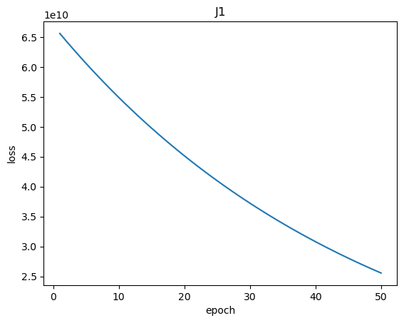

## 10.2 $\alpha = 0.03$

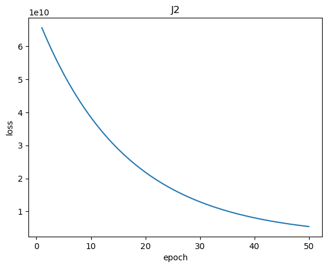

## 10.3 $\alpha = 0.1$

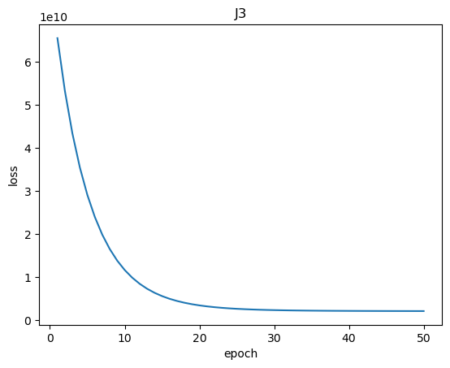

## 10.4 $\alpha = 0.3$

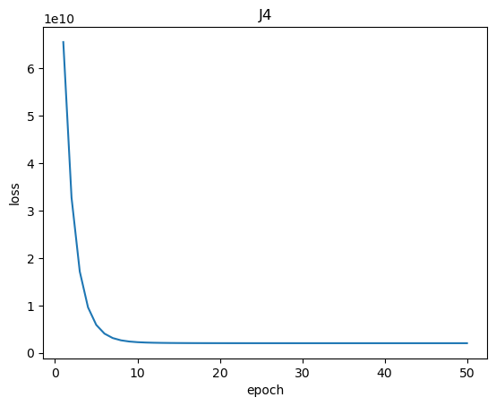

## 10.5 $\alpha = 0.6$

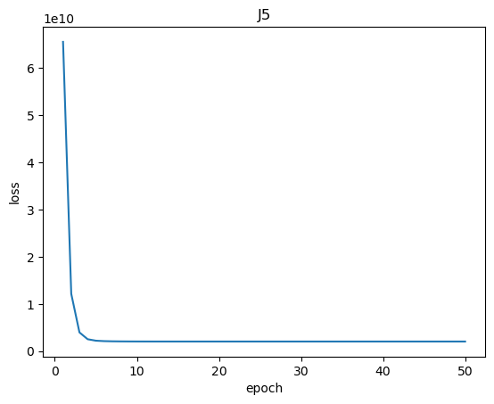

## 10.6 $\alpha = 1.0$

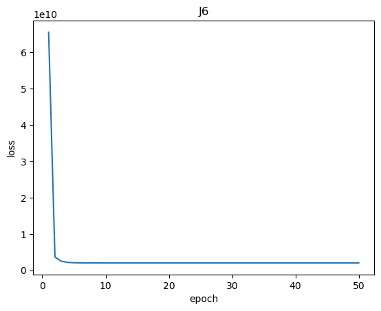

## 10.7 $\alpha=1.3$

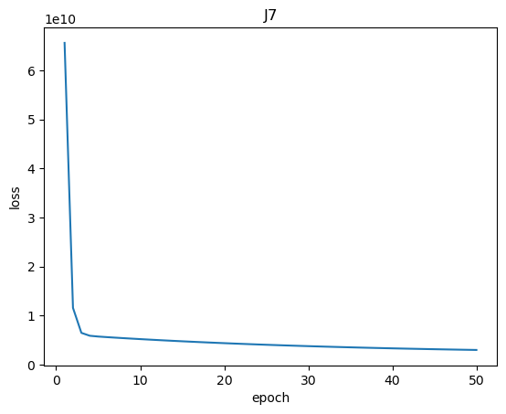

## 10.8 $\alpha=1.32$

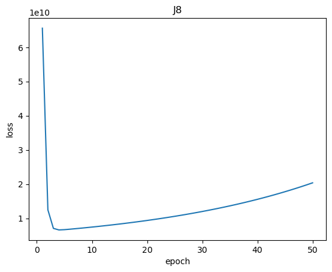

## 10.9 $\alpha = 1.33$

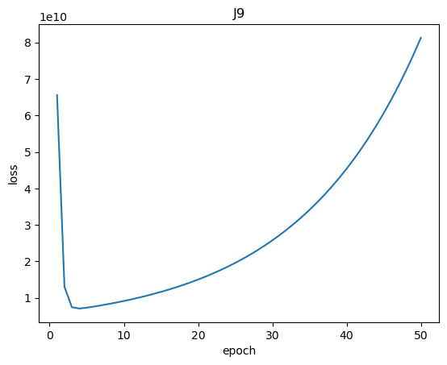

## 10.10 $\alpha = 10$


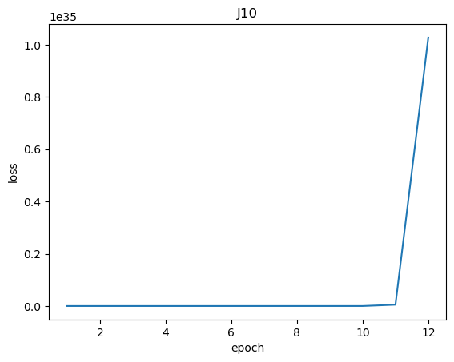

## 统一在一张图上

```py
xx = [i for i in range(1, num_epochs + 1)]
plt.plot(xx, J1)
plt.plot(xx, J2)
plt.plot(xx, J3)
plt.plot(xx, J4)
plt.plot(xx, J5)
plt.plot(xx, J6)
plt.plot(xx, J7)
plt.plot(xx, J8)
plt.plot(xx, J9)
plt.legend([f"J1:{a1}",f"J2:{a2}",f"J3:{a3}",f"J4:{a4}",f"J5:{a5}",f"J6:{a6}",f"J7:{a7}",f"J8:{a8}",f"J9:{a9}"])
```


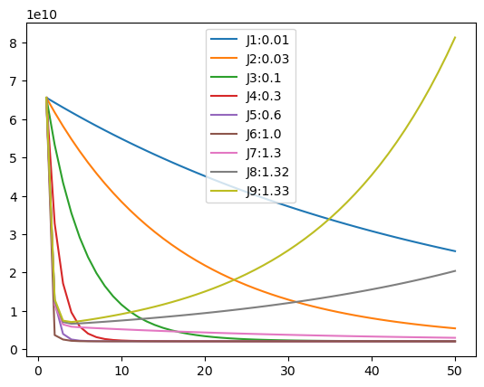


其中，由于当学习率为10时，loss会远远大于其他的几个学习率的值，达到$10^{35}$，远远超过其他学习率，因此并没有画在上图中。

以上10个学习率下，训练50轮后，参数分别如下：

```py
print(f"w1final:{w1final}\n")
print(f"w2final:{w2final}\n")
print(f"w3final:{w3final}\n")
print(f"w4final:{w4final}\n")
print(f"w5final:{w5final}\n")
print(f"w6final:{w6final}\n")
print(f"w7final:{w7final}\n")
print(f"w8final:{w8final}\n")
print(f"w9final:{w9final}\n")
print(f"w10final:{w10final}\n")
```


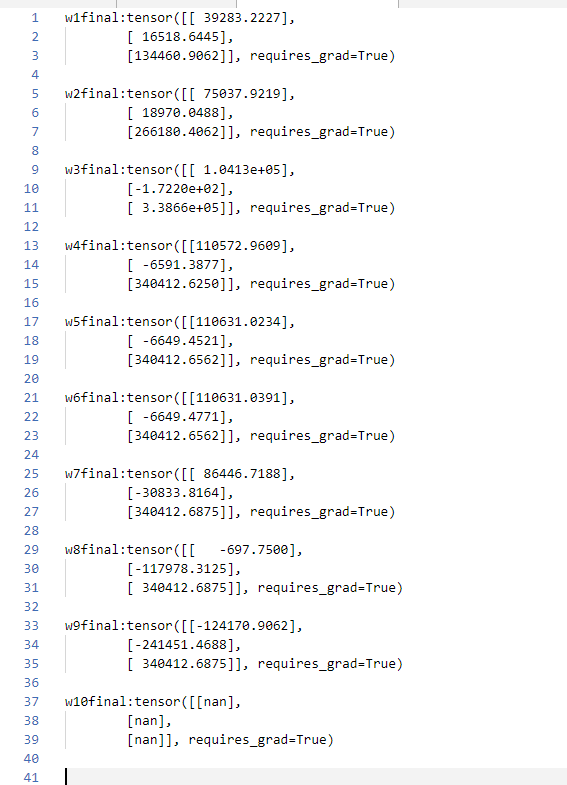


# 11 回答问题

## 11.1 Observe the changes in the cost function happens as the learning rate changes. What happens when the learning rate is too small? Too large?

观察上述实验，可以发现，在线性模型中，学习率与收敛速率密切相关。当学习率过小，收敛速率就会过慢，随着学习率的增大，收敛速率不断增大，但当学习率过大的时候，反而会不收敛。

## 11.2 Using the best learning rate that you found, run gradient descent until convergence to find

取效果最好的，$\alpha = 0.1$ 的参数值，进行预测。

```py
# 预测
def output(x):
    # 标准化第0列和第1列
    x[:, 0] = (x[:, 0] - mu[0]) / sigma[0]
    x[:, 1] = (x[:, 1] - mu[1]) / sigma[1]
    print(x)
    w = copy.deepcopy(w3final)
    return torch.matmul(x, w)

x = torch.tensor([[1650., 3., 1.]])

y_hat = output(x)
print(y_hat)
```

结果：

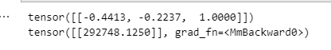

# 12 Normal Equation

$$
w = (X^TX)^{-1}X^Ty
$$


代码如下：

```py
a = torch.matmul(x.T, x)
a = torch.inverse(a)
b = torch.matmul(a, x.T)
c = torch.matmul(b, y)
w = c
print(w)
```

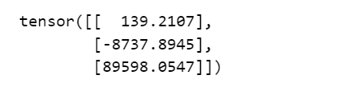

```py
x_new = torch.tensor([[1650., 3., 1.]])
out = torch.matmul(x_new, w)
print(out)
```

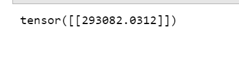

结果与梯度下降的结果有出入，但误差可以接受。
