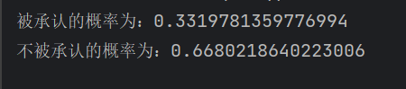

# 写在前面

本实验仍然采用`pytorch`实现。其中与实验1一样，对实验指导书中对x的处理做了一些改变，并对实验指导书的公式进行了一些调整，如下：

我采用了和实验指导书不一样的x，我将新添加的列放在了原来x的后面，即：
$$
X = 
\begin{bmatrix}
x_{11}^T&x_{12}^T&1\\
x_{21}^T&x_{22}^T&1\\
\vdots&\vdots&\vdots\\
x_{m1}^T&x_{m2}^T&1
\end{bmatrix}
$$
则原本的参数$\omega$ 变为
$$
\hat\omega = [\omega;b]
$$
## 激活函数

$$
h_\theta(x) = \frac{1}{1+e^{-x\theta}}
$$
它具有以下几个性质：

1. $h_\theta(x)\in[0,1]$
2. $h_\theta(x) + h_\theta(-x) = 1$
3. $\bigtriangledown h_\theta(x) = h_\theta(x)(1-h_\theta(x))$


## 损失函数：

$$
J(\theta)=\frac{1}{m}\sum_{i=1}^{m}[-y^{(i)}log(h_{\theta}(x^{(i)}))-(1-y^{(i)})log(1-h_{\theta}(x^{(i)}))]
$$
转为矩阵形式：
$$
J(\theta)=\frac{1}{m}(-Y^Tlog(h_{\theta}(X))-(1-Y^T)log(1-h_{\theta}(X)))
$$
## 损失函数的梯度：

$$
\nabla_{\theta}J=\frac{1}{m}\sum_{i=1}^{m}(h_{\theta}(x^{(i)})-y^{(i)})x^{(i)}
$$
矩阵形式为：
$$
\nabla_{\theta}J=\frac{1}{m}X^T(h_{\theta}(X)-Y)
$$

## 二阶导（海森矩阵）：

$$
H=\frac{1}{m}\sum_{i=1}^{m} x^{(i)}x^{(i)T}(h_{\theta}(x^{(i)}))(1-h_{\theta}(x^{(i)}))\\
矩阵形式：\\
H=\frac{1}{m} X^T diag(h_{\theta}(X))diag(1-h_{\theta}(X))X\\
其中diag为列向量变成对角矩阵
$$
维度：
$$
x_{(i)}:R^{d*1},h_\theta(x_{(i)}):R^1 \rightarrow H:R^{d*d}
$$

## 参数更新方法：

$$
\Theta^{(t+1)}:=\Theta^{(t)}-H^{-1}\nabla_{\theta}J\\
$$


发现的错误：


这段代码是想计算海森矩阵，其中，x[1] 为 torch.tensor([1, 2, 3])，注意，这时x[1]不为1*3的向量，应该通过如图所示，转为x1才是1 *  3 的！


# 代码

## 数据加载与头文件

```py
import torch
import numpy as np
import matplotlib.pyplot as plt

# 加载数据
x = torch.tensor(np.loadtxt('ex4x.dat'), dtype=torch.float64)
y = torch.tensor(np.loadtxt('ex4y.dat'), dtype=torch.float64)
y = y.reshape(-1, 1)  # 1 接受；0 拒绝
```


## 为x添加截距项

```py
# 添加截距项
# 为x新添加一列，放在最后
m = x.size(0)
# print(m)
new_colunm = torch.ones(m).reshape(-1, 1)
x = torch.cat((x, new_colunm), dim=1)
# print(x.shape)
```


## 绘图

```python
pos = torch.where(y == 1)[0]
neg = torch.where(y == 0)[0]
# print(torch.where(y == 1))

# 假设特征数据位于 x 张量的第0列和第1列
# 绘制正例（y == 1）数据点为 '+'，负例（y == 0）数据点为 'o'
plt.plot(x[pos, 0], x[pos, 1], '+', label='Admitted')
plt.plot(x[neg, 0], x[neg, 1], 'o', label='Not Admitted')

plt.legend()
# 显示图形
plt.show()
```


## 激活函数

```py
# 定义激活函数
def h(x, w):
    t = 1 / (1 + torch.exp(-x @ w))
    return t
```


## 损失函数

```python
# 定义损失函数
def J(x, y, w):
    t = h(x, w)
    t1 = -torch.matmul(y.T, torch.log(t + 1e-8))
    tt = torch.log(1 - t)
    ttt = 1 - y.T
    # print(y.T.shape)
    t2 = torch.matmul((1 - y.T), torch.log(1 - t + 1e-8))
    return (t1 - t2) / m  # 1 * 1
```

## 损失函数的一阶导数

```py
# 损失函数的一阶导数
def J1(x, y, w):
    t1 = h(x, w)
    return torch.matmul(x.T, (t1 - y)) / m  # 1 * 1
```

## 损失函数的二阶导数（海森矩阵）

```py
# 海森矩阵，求损失函数的二阶导
def J2(x, y, w):
    # t = h(x, w).view(-1)
    # t = t * (-t)
    # diag1 = torch.diag(t)
    # # diag2 = torch.diag(1 - t)
    # # ans = torch.matmul((torch.matmul(x.T, diag1), x)) / m
    # # return torch.matmul(torch.matmul(torch.matmul(x.T, diag1), diag2), x) / m  # d * d
    # ans = torch.matmul(torch.matmul(x.T, diag1), x) / m
    # return ans
    ans = None
    for i in range(m):
        h1 = h(x[i], w)
        h2 = 1 - h(x[i], w)
        x1 = x[i].view(1, -1)  # 1 * d
        # ttttt = x1.shape
        xT = x[i].view(-1, 1)  # d*1
        # ttt = torch.matmul(xT, x1)
        t = torch.matmul(xT, x1) * h1 * h2
        if i == 0:
            ans = t
        else:
            ans += t
    ans /= m
    return ans
```

## 训练

```py
# 训练
epoch_num = 15

xx = [i for i in range(1, epoch_num + 1)]
yy = []
ww = []
ww.append(w)

for epoch in range(epoch_num):
    loss = J(x, y, w)
    yy.append(loss.tolist()[0])
    print(loss)
    w = w - torch.matmul(torch.inverse(J2(x, y, w)), J1(x, y, w))
    ww.append(w)

plt.plot(xx, yy)
plt.show()

print(ww[-1])
```

## 结果：

### 损失


### 参数


## 绘图

```py
# 绘图

tx = [i for i in range(10, 70 + 1)]

w2 = ww[-1].tolist()


def linear(x):
    return -(x * w2[0][0] + w2[2][0]) / w2[1][0]


x2 = []
for i in range(len(tx)):
    x2.append(linear(tx[i]))

plt.plot(tx, x2, label='linear')

# 假设特征数据位于 x 张量的第0列和第1列
# 绘制正例（y == 1）数据点为 '+'，负例（y == 0）数据点为 'o'
plt.plot(x[pos, 0], x[pos, 1], '+', label='Admitted')
plt.plot(x[neg, 0], x[neg, 1], 'o', label='Not Admitted')

plt.legend()
# 显示图形
plt.show()
```


## 回答问题

### 1 What values of θ did you get? How many iterations were required for convergence?


$\theta_0 = 0.1483$

$\theta_1 = 0.1589$

$b=-16.3787$

观察loss曲线：


知，约在第五轮左右收敛。

### 2 What is the probability that a student with a score of 20 on Exam 1 and a score of 80 on Exam 2 will not be admitted?

```py
# 问题2
ans = torch.tensor([[20., 80., 1]]).to(torch.float64)
P = h(ans, ww[-1])
print(f'被承认的概率为：{P[0][0].tolist()}')
print(f'不被承认的概率为：{1-P[0][0].tolist()}')
```




# 完整代码

```py
import torch
import numpy as np
import matplotlib.pyplot as plt

# 加载数据
x = torch.tensor(np.loadtxt('ex4x.dat'), dtype=torch.float64)
y = torch.tensor(np.loadtxt('ex4y.dat'), dtype=torch.float64)
y = y.reshape(-1, 1)  # 1 接受；0 拒绝

# 添加截距项
# 为x新添加一列，放在最后
m = x.size(0)
# print(m)
new_colunm = torch.ones(m).reshape(-1, 1)
x = torch.cat((x, new_colunm), dim=1)
# print(x.shape)

# plot the data

pos = torch.where(y == 1)[0]
neg = torch.where(y == 0)[0]
# print(torch.where(y == 1))

# 假设特征数据位于 x 张量的第0列和第1列
# 绘制正例（y == 1）数据点为 '+'，负例（y == 0）数据点为 'o'
plt.plot(x[pos, 0], x[pos, 1], '+', label='Admitted')
plt.plot(x[neg, 0], x[neg, 1], 'o', label='Not Admitted')

plt.legend()
# 显示图形
plt.show()

# 定义参数
w = torch.zeros(3, 1).to(torch.float64)


# print(x[0])

# print(w)

# 定义激活函数
def h(x, w):
    t = 1 / (1 + torch.exp(-x @ w))
    return t


# 定义损失函数
def J(x, y, w):
    t = h(x, w)
    t1 = -torch.matmul(y.T, torch.log(t + 1e-8))
    tt = torch.log(1 - t)
    ttt = 1 - y.T
    # print(y.T.shape)
    t2 = torch.matmul((1 - y.T), torch.log(1 - t + 1e-8))
    return (t1 - t2) / m  # 1 * 1


# 损失函数的一阶导数
def J1(x, y, w):
    t1 = h(x, w)
    return torch.matmul(x.T, (t1 - y)) / m  # 1 * 1


# 海森矩阵，求损失函数的二阶导
def J2(x, y, w):
    # t = h(x, w).view(-1)
    # t = t * (-t)
    # diag1 = torch.diag(t)
    # # diag2 = torch.diag(1 - t)
    # # ans = torch.matmul((torch.matmul(x.T, diag1), x)) / m
    # # return torch.matmul(torch.matmul(torch.matmul(x.T, diag1), diag2), x) / m  # d * d
    # ans = torch.matmul(torch.matmul(x.T, diag1), x) / m
    # return ans
    ans = None
    for i in range(m):
        h1 = h(x[i], w)
        h2 = 1 - h(x[i], w)
        x1 = x[i].view(1, -1)  # 1 * d
        # ttttt = x1.shape
        xT = x[i].view(-1, 1)  # d*1
        # ttt = torch.matmul(xT, x1)
        t = torch.matmul(xT, x1) * h1 * h2
        if i == 0:
            ans = t
        else:
            ans += t
    ans /= m
    return ans


# 训练
epoch_num = 15

xx = [i for i in range(1, epoch_num + 1)]
yy = []
ww = []
ww.append(w)

for epoch in range(epoch_num):
    loss = J(x, y, w)
    yy.append(loss.tolist()[0])
    print(loss)
    w = w - torch.matmul(torch.inverse(J2(x, y, w)), J1(x, y, w))
    ww.append(w)

plt.plot(xx, yy)
plt.show()

print(ww[-1])

# 绘图

tx = [i for i in range(10, 70 + 1)]

w2 = ww[-1].tolist()


def linear(x):
    return -(x * w2[0][0] + w2[2][0]) / w2[1][0]


x2 = []
for i in range(len(tx)):
    x2.append(linear(tx[i]))

plt.plot(tx, x2, label='linear')

# 假设特征数据位于 x 张量的第0列和第1列
# 绘制正例（y == 1）数据点为 '+'，负例（y == 0）数据点为 'o'
plt.plot(x[pos, 0], x[pos, 1], '+', label='Admitted')
plt.plot(x[neg, 0], x[neg, 1], 'o', label='Not Admitted')

plt.legend()
# 显示图形
plt.show()

# 问题2
ans = torch.tensor([[20., 80., 1]]).to(torch.float64)
P = h(ans, ww[-1])
print(f'被承认的概率为：{P[0][0].tolist()}')
print(f'不被承认的概率为：{1-P[0][0].tolist()}')
```

