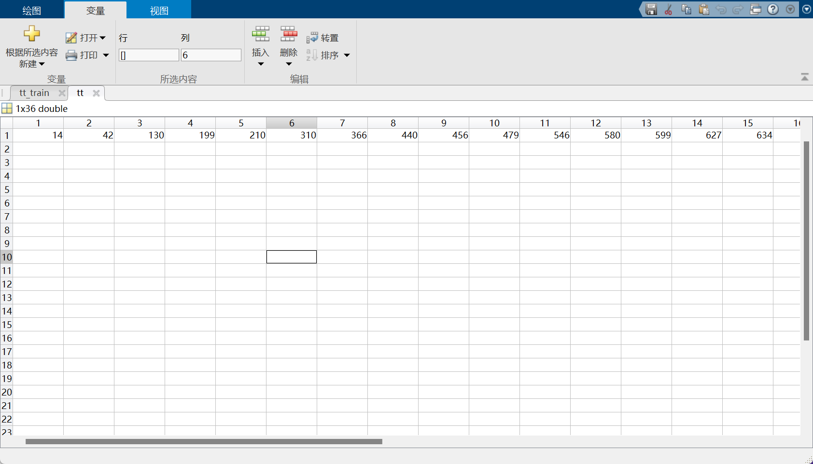

# lab 5：SVM

SVM实验一共有两部分，分别让我们用

1. SVM在training data上画出分类边界。
2. 使用test data来验证分类边界。
3. 尝试使用不同的regularization term C，说明你的发现。

## 2 SVM

### 2.1 导入数据并绘图

```matlab
train_intNum = load("data5\data5\training_1.txt");
train_y = train_intNum(:, 3);
train_x = train_intNum(:, 1 : 2);
% 绘制散点图
figure;
gscatter(train_x(:,1), train_x(:,2), train_y, 'br', 'o*'); % 根据标签数据绘制散点图
xlabel('X1');
ylabel('X2');
title('train');

% 设置图例和形状
legend('Label:1', 'Label:-1');

% 测试集
test_intNum = load("data5\data5\test_1.txt");
test_y = test_intNum(:, 3);
test_x = test_intNum(:, 1 : 2);
% 绘制散点图
figure;
gscatter(test_x(:,1), test_x(:,2), test_y, 'br', 'o*'); % 根据标签数据绘制散点图
xlabel('X1');
ylabel('X2');
title('test');

% 设置图例和形状
legend('Label:1', 'Label:-1');

```


### 2.2 使用qp求解器求解alpha

我们使用quadprog求解器进行求解，quadprog求解器的形式如下：


我们要解决的问题形式如下：


我们需要首先寻找到对应关系：

观察可知：

这里的$x$ 为 $\alpha$，$f$为与$\alpha$同维度的全为-1的向量。

$H$我们通过循环算出，$H[i][j] = y[i]*y[j]*<x[i],x[j]>$。

对于约束条件：

$Aeq = y$

$lb = 0 $

$ub = C\in R^{1500}$

**代码**

```matlab
% 设置惩罚参数
C = 100;
% alpha 为我们求解器返回的结果
[m,n] = size(train_x);
f = ones(m,1);
f = -f;
Aeq = train_y';
beq = 0;
lb = zeros(m, 1);
ub = C * ones(m, 1);

% 计算H
H = zeros(m);
for i  = 1 : m
   for j = 1 : m
      H(i, j) = train_y(i) * train_y(j) * dot(train_x(i,:), train_x(j,:));
   end
end

alpha = quadprog(H, f, [], [], Aeq, beq, lb, ub);
```


 结果：


### 2.3 计算$w^*$ 

接下来要根据$\alpha$信息计算$w$

我们根据公式：
$$
w = \sum_{i=1}^{m} \alpha_i y_i x_i
$$
因此计算如下：

代码：

```matlab
% 计算w
w = [0, 0];
for i = 1 : m
    t = alpha(i) * train_y(i) * train_x(i, :);
    w = w + t;
end
```

结果：


### 2.4计算$b^*$

我们采用以下方式：
$$
b^* = \frac{1}{|S|}\sum_{s\in S} (\frac{1}{y_s} - \sum_{i \in S}\alpha_iy_i\vec x_i^T\vec x_s)
$$


代码

```matlab
% 计算b
b = 0;
for s = 1 : m
    for i = 1 : m
        t = alpha(i) * train_y(i) * dot(train_x(i,:), train_x(s,:));
    end
    t2 = 1/train_y(s) - t;
    b = b + t2;
end
b = b / m;
```

结果：


### 2.5 绘图

#### 2.5.1 训练集

代码：

```matlab
% 绘结果
figure;
gscatter(train_x(:,1), train_x(:,2), train_y, 'br', 'o*'); % 根据标签数据绘制散点图
xlabel('X1');
ylabel('X2');
title('train1');

% 设置图例和形状
legend('Label:1', 'Label:-1');
hold on
x = linspace(190, 10);  % 在指定范围内生成 x 值
% 计算直线的斜率和截距
m = -w(1) / w(2);       % 斜率
c = -b / w(2);          % 截距
% 计算直线的 y 值
y = m * x + c;

% 绘制直线
plot(x, y);
xlabel('x');
ylabel('y');
title('train');
grid on;
```


#### 2.5.2 测试集

代码：

```matlab
% 测试集
test_intNum = load("data5\data5\test_1.txt");
test_y = test_intNum(:, 3);
test_x = test_intNum(:, 1 : 2);
% 绘制散点图
figure;
gscatter(test_x(:,1), test_x(:,2), test_y, 'br', 'o*'); % 根据标签数据绘制散点图
xlabel('X1');
ylabel('X2');
title('test1');

% 设置图例和形状
legend('Label:1', 'Label:-1');

% 绘制SVM直线
hold on
x = linspace(190, 10);  % 在指定范围内生成 x 值
% 计算直线的斜率和截距
m = -w(1) / w(2);       % 斜率
c = -b / w(2);          % 截距
% 计算直线的 y 值
y = m * x + c;

% 绘制直线
plot(x, y);
xlabel('x');
ylabel('y');
title('test');
grid on;
```


### 2.6 第二组数据

第二组数据与第一组流程一样，不再分条赘述，直接给出总的实验代码

#### 2.6.1 代码

```matlab
% 第二组数据

train_intNum = load("data5\data5\training_2.txt");
train_y = train_intNum(:, 3);
train_x = train_intNum(:, 1 : 2);
% 绘制散点图
figure;
gscatter(train_x(:,1), train_x(:,2), train_y, 'br', 'o*'); % 根据标签数据绘制散点图
xlabel('X1');
ylabel('X2');
title('train2');

% 设置图例和形状
legend('Label:1', 'Label:-1');

% 设置惩罚参数
C = 0.01;
% alpha 为我们求解器返回的结果
[m,n] = size(train_x);
f = ones(m,1);
f = -f;
Aeq = train_y';
beq = 0;
lb = zeros(m, 1);
ub = C * ones(m, 1);

% 计算H
H = zeros(m);
for i  = 1 : m
   for j = 1 : m
      H(i, j) = train_y(i) * train_y(j) *(train_x(i, 1) * train_x(j, 1) + train_x(i, 2) * train_x(j , 2));
   end
end

alpha = quadprog(H, f, [], [], Aeq, beq, lb, ub);
% train_x(1)

% 计算w
w = [0, 0];
for i = 1 : m
    t = alpha(i) * train_y(i) * train_x(i, :);
    w = w + t;
end

% 计算b
b = 0;
for s = 1 : m
    for i = 1 : m
        t = alpha(i) * train_y(i) * dot(train_x(i,:), train_x(s,:));
    end
    t2 = 1/train_y(s) - t;
    b = b + t2;
end
b = b / m;

% 绘结果
figure;
gscatter(train_x(:,1), train_x(:,2), train_y, 'br', 'o*'); % 根据标签数据绘制散点图
xlabel('X1');
ylabel('X2');
title('train1');

% 设置图例和形状
legend('Label:1', 'Label:-1');
hold on
x = linspace(190, 10);  % 在指定范围内生成 x 值
% 计算直线的斜率和截距
m = -w(1) / w(2);       % 斜率
c = -b / w(2);          % 截距
% 计算直线的 y 值
y = m * x + c;

% 绘制直线
plot(x, y);
xlabel('x');
ylabel('y');
title('train');
grid on;

% 测试集
test_intNum = load("data5\data5\test_2.txt");
test_y = test_intNum(:, 3);
test_x = test_intNum(:, 1 : 2);
% 绘制散点图
figure;
gscatter(test_x(:,1), test_x(:,2), test_y, 'br', 'o*'); % 根据标签数据绘制散点图
xlabel('X1');
ylabel('X2');
title('test1');

% 设置图例和形状
legend('Label:1', 'Label:-1');

% 绘制SVM直线
hold on
x = linspace(190, 10);  % 在指定范围内生成 x 值
% 计算直线的斜率和截距
m = -w(1) / w(2);       % 斜率
c = -b / w(2);          % 截距
% 计算直线的 y 值
y = m * x + c;

% 绘制直线
plot(x, y);
xlabel('x');
ylabel('y');
title('test');
grid on;
```

结果：

**alpha:**


**w:**


**b**


**训练集**


**测试集：**


**结论：**

我们这次通过观察训练集的点，发现应当将$C$设为较小的值，我们设为0.01。

最终可以发现SVM的结果正确的对模型进行了分类。

### 2.7 回答问题

1. Plot the decision boundary of the SVM with the training data.

见上文。

2. Use the test data to evaluate the SVM classififier and show the fraction of

   test examples which were misclassifified

第一组数据：

测试集和训练集错误率均为0

第二组数据：

训练集错误率为1.92%

测试集错误率为2.43%

3. Try difffferent values of the regularization term *C*, and report your obser

   vations

我们以第二组数据为例，尝试不同的C值。

**C=10：**

训练集


**测试集：**


**C = 0.0001：**


对比可以发现，C值越大，对犯错的惩罚力度就越大，越小，对犯错的惩罚力度就越小。


## 3 手写数字识别

本实验要求我们利用上述实现的SVM来训练一个图像分类器来识别手写数字。

观察训练集：


可以发现数据中只有正负类，每个图像均用一串数字表示。

因此我们只需要将数据集中的每行作为x，利用高维空间的SVM，即可进行分类。

### 3.1 实现strimage.m

添加注释理解该函数：

```matlab
function strimage(n)
    fidin = fopen('train-01-images.svm'); % 打开train-01-images.svm文件
    i = 1;
    apres = [];

    while ~feof(fidin)
        tline = fgetl(fidin); % 从文件读取一行
        apres{i} = tline;
        i = i + 1;
    end

    a = char(apres(n)); % 获取第 n 行的字符串数据

    lena = size(a);
    lena = lena(2);
    xy = sscanf(a(4:lena), '%d:%d'); % 解析字符串，提取像素坐标及灰度值

    lenxy = size(xy);
    lenxy = lenxy(1);

    grid = zeros(1, 784); % 初始化包含 784 个元素的零向量
    for i = 2:2:lenxy  % 遍历坐标和灰度值
        if(xy(i) <= 0)
            break
        end
        grid(xy(i - 1)) = xy(i) * 100 / 255; % 计算灰度值并存储在 grid 中
    end
    grid1 = reshape(grid, 28, 28); % 重新塑造为 28x28 的矩阵
    grid1 = fliplr(diag(ones(28, 1))) * grid1; % 矩阵翻转
    grid1 = rot90(grid1, 3); % 矩阵旋转
    image(grid1); % 显示图像
    hold on;
end
```


这个代码将每行数据读出，并转换为一个28*28的矩阵，存储在`graid1`中，我们接下来要做的就是把每个矩阵存下来，然后打上对应的标签。


然后我们采用strimage的思想，读取训练数据集：

### 3.2 读取训练数据集

```matlab
% 打开文件
fileID = fopen('train-01-images.svm', 'r');

% 读取文件内容
C = textscan(fileID, '%s', 'Delimiter', '\n');
fclose(fileID);

% 获取行数
numRows = length(C{1});

% 初始化存储数据的数组
apres = zeros(numRows, 4); % 假设有4列

% 将数据分割成不同列并存储到数组中
for i = 1:numRows
    % 将每行内容按空格分割
    line = strsplit(C{1}{i}, ' ');
    
    % 第一个元素为类别，将其存储到数组第一列
    apres(i, 1) = str2double(line{1});
    
    % 处理每个特征
    for j = 2:length(line)
        % 将特征索引和值分开
        feature = strsplit(line{j}, ':');
        
        % 检查特征是否有两个部分（索引和值）
        if length(feature) == 2
            index = str2double(feature{1});
            value = str2double(feature{2});
            
            % 存储特征索引和值到对应列
            apres(i, index + 1) = value; % index + 1 因为第一列被用于存储类别
        else
            % 处理特征不完整的情况（如空值或格式错误）
            fprintf('特征格式错误或为空值\n');
        end
    end
end

% 显示结果
% disp(apres);

% 提取apres的第一列赋值给y
y = apres(:, 1);

% 删除apres的第一列
apres(:, 1) = [];

train_x = apres;
train_y = y;
```


结果如下：


### 3.3 进行训练


然后利用上个SVM的实验，进行训练。

```matlab
% alpha 为我们求解器返回的结果
[m,n] = size(train_x);
f = ones(m,1);
f = -f;
Aeq = train_y';
beq = 0;
lb = zeros(m, 1);
ub = C * ones(m, 1);

% 计算H
H = zeros(m);
for i  = 1 : m
   for j = 1 : m
      H(i, j) = train_y(i) * train_y(j) *(train_x(i, 1) * train_x(j, 1) + train_x(i, 2) * train_x(j , 2));
   end
end

alpha = quadprog(H, f, [], [], Aeq, beq, lb, ub);
```


```matlab
% 计算w
w = zeros(1, 744);
for i = 1 : m
    t = alpha(i) * train_y(i) * train_x(i, :);
    w = w + t;
end

% 计算b
b = 0;
for s = 1 : m
    if mod(s, 100) == 0
        disp(s);
    end
    for i = 1 : m
        t = alpha(i) * train_y(i) * dot(train_x(i,:), train_x(s,:));
    end
    t2 = 1/train_y(s) - t;
    b = b + t2;
end
b = b / m;
```

**b:**


### 3.4 结果测试

对测试集进行同样的处理：

#### 3.4.1 读取测试数据

```mathematica
% 检测
% 打开文件
fileID = fopen('data5\data5\test-01-images.svm', 'r');

% 读取文件内容
C = textscan(fileID, '%s', 'Delimiter', '\n');
fclose(fileID);

% 获取行数
numRows = length(C{1});

% 初始化存储数据的数组
apres2 = zeros(numRows, 4); % 假设有4列

% 将数据分割成不同列并存储到数组中
for i = 1:numRows
    % 将每行内容按空格分割
    line = strsplit(C{1}{i}, ' ');
    
    % 第一个元素为类别，将其存储到数组第一列
    apres2(i, 1) = str2double(line{1});
    
    % 处理每个特征
    for j = 2:length(line)
        % 将特征索引和值分开
        feature = strsplit(line{j}, ':');
        
        % 检查特征是否有两个部分（索引和值）
        if length(feature) == 2
            index = str2double(feature{1});
            value = str2double(feature{2});
            
            % 存储特征索引和值到对应列
            apres2(i, index + 1) = value; % index + 1 因为第一列被用于存储类别
        else
            % 处理特征不完整的情况（如空值或格式错误）
            fprintf('特征格式错误或为空值\n');
        end
    end
end


% 提取apres的第一列赋值给y
y = apres2(:, 1);

% 删除apres的第一列
apres2(:, 1) = [];
test_x = apres2;
test_y = y;
```


结果：


#### 3.4.2 进行测试

```matlab
tt = [];
for i = 1 : 2115
    if result_y2(i) ~= test_y(i)
        tt(end+1) = i;
    end
end
tt
```

结果与测试结果有不一样的，序号存在tt中。

结果如下：




我们可以看到，此时测试结果非常好，在2115个测试样例中，只有36个没有被正确分类，错误率只有1.7%。

我们利用`strimage`输出几个错误图片，进行观察：


### 3.5 回答问题

1. 对训练集进行分析得：

```matlab
% 对训练集进行测试
train_test_y = train_x * w' + b;
train_test_y2 = sign(train_test_y);
tt_train = [];
[m, n] = size(train_test_y2);
for i = 1 : m
    if train_test_y2(i) ~= train_y(i)
        tt_train(end+1) = i;
    end
end
tt_train
```

结果：


我们取8,19进行查看：


可以发现，在训练集上分类的准确率非常高，12665个样本中，只有278个没有被正确分类，错误率仅为：2.195%。

没有正确分类的原因可能跟c值的设置有关系。

测试集结果见前面回答。

### 3.6 使用不同的c

|  C   | 正确率 |
| :--: | :----: |
|  1   | 98.52% |
|  10  | 98.68% |
|  0   | 98.42% |

### 完整代码

```matlab
% 打开文件
fileID = fopen('data5\data5\train-01-images.svm', 'r');

% 读取文件内容
C = textscan(fileID, '%s', 'Delimiter', '\n');
fclose(fileID);

% 获取行数
numRows = length(C{1});

% 初始化存储数据的数组
apres = zeros(numRows, 4); % 假设有4列

% 将数据分割成不同列并存储到数组中
for i = 1:numRows
    % 将每行内容按空格分割
    line = strsplit(C{1}{i}, ' ');
    
    % 第一个元素为类别，将其存储到数组第一列
    apres(i, 1) = str2double(line{1});
    
    % 处理每个特征
    for j = 2:length(line)
        % 将特征索引和值分开555
        feature = strsplit(line{j}, ':');
        
        % 检查特征是否有两个部分（索引和值）
        if length(feature) == 2
            index = str2double(feature{1});
            value = str2double(feature{2});
            
            % 存储特征索引和值到对应列
            apres(i, index + 1) = value; % index + 1 因为第一列被用于存储类别
        else
            % 处理特征不完整的情况（如空值或格式错误）
            fprintf('特征格式错误或为空值\n');
        end
    end
end

% 显示结果
% disp(apres);

% 提取apres的第一列赋值给y
y = apres(:, 1);

% 删除apres的第一列
apres(:, 1) = [];


c = 0.01;
train_x = apres;
train_y = y;
% alpha 为我们求解器返回的结果
[m,n] = size(train_x);
f = ones(m,1);
f = -f;
Aeq = train_y';
beq = 0;
lb = zeros(m, 1);
ub = c * ones(m, 1);

% 计算H
H = zeros(m);
for i  = 1 : m
   for j = 1 : m
      H(i, j) = train_y(i) * train_y(j) *(train_x(i, 1) * train_x(j, 1) + train_x(i, 2) * train_x(j , 2));
   end
end

alpha = quadprog(H, f, [], [], Aeq, beq, lb, ub);
% train_x(1) 

% 计算w
w = zeros(1, 744);
for i = 1 : m
    t = alpha(i) * train_y(i) * train_x(i, :);
    w = w + t;
end

% 计算b
b = 0;
for s = 1 : m
    if mod(s, 100) == 0
        disp(s);
    end
    for i = 1 : m
        t = alpha(i) * train_y(i) * dot(train_x(i,:), train_x(s,:));
    end
    t2 = 1/train_y(s) - t;
    b = b + t2;
end
b = b / m;

% 对训练集进行测试
train_test_y = train_x * w' + b;
train_test_y2 = sign(train_test_y);
tt_train = [];
[m, n] = size(train_test_y2);
for i = 1 : m
    if train_test_y2(i) ~= train_y(i)
        tt_train(end+1) = i;
    end
end
tt_train

strimage('data5\data5\train-01-images.svm',8)

strimage('data5\data5\train-01-images.svm',19)

% 检测
% 打开文件
fileID = fopen('data5\data5\test-01-images.svm', 'r');

% 读取文件内容
C = textscan(fileID, '%s', 'Delimiter', '\n');
fclose(fileID);

% 获取行数
numRows = length(C{1});

% 初始化存储数据的数组
apres2 = zeros(numRows, 4); % 假设有4列

% 将数据分割成不同列并存储到数组中
for i = 1:numRows
    % 将每行内容按空格分割
    line = strsplit(C{1}{i}, ' ');
    
    % 第一个元素为类别，将其存储到数组第一列
    apres2(i, 1) = str2double(line{1});
    
    % 处理每个特征
    for j = 2:length(line)
        % 将特征索引和值分开
        feature = strsplit(line{j}, ':');
        
        % 检查特征是否有两个部分（索引和值）
        if length(feature) == 2
            index = str2double(feature{1});
            value = str2double(feature{2});
            
            % 存储特征索引和值到对应列
            apres2(i, index + 1) = value; % index + 1 因为第一列被用于存储类别
        else
            % 处理特征不完整的情况（如空值或格式错误）
            fprintf('特征格式错误或为空值\n');
        end
    end
end


% 提取apres的第一列赋值给y
y = apres2(:, 1);

% 删除apres的第一列
apres2(:, 1) = [];
test_x = apres2;
test_y = y;


% 进行测试：
w_test = w(1:718);
result_y = test_x*(w_test') + b;

result_y2 = sign(result_y);

tt = [];
for i = 1 : 2115
    if result_y2(i) ~= test_y(i)
        tt(end+1) = i;
    end
end
tt


strimage('data5\data5\test-01-images.svm',14)

strimage('data5\data5\test-01-images.svm',24)

```


## 4 非线性SVM

我们使用RBF核来处理这个问题：


### 4.1 读入数据并画图

```matlab
data = readmatrix('data5\data5\training_3.txt');

dataSize = size(data, 1);

feature1 = data(:, 1);
feature2 = data(:, 2);
features = [feature1, feature2];
labels = data(:, 3);

class1_indices = find(labels == 1);
class2_indices = find(labels == -1);

figure;
plot(feature1(class1_indices), feature2(class1_indices), 'r.');
hold on;
plot(feature1(class2_indices), feature2(class2_indices), 'g.');
hold on;
```


### 4.2 利用核函数进行SVM处理

```matlab
% Gaussian Kernel Calculation using pdist2 function
gamma = 1000;
k = exp(-gamma * pdist2(features, features, 'euclidean').^2);

H = labels * labels' .* k;

f = -ones([1, dataSize])';

Aeq = labels';

beq = 0;

c = 1;
upper_bound = c .* ones([dataSize, 1]);

lower_bound = zeros([dataSize, 1]);

[my_ans, f_val] = quadprog(H, f, [], [], Aeq, beq, lower_bound, upper_bound);

support_vectors_indices = find(my_ans > 1e-5);

support_vectors_x = features(support_vectors_indices, :);
support_vectors_y = labels(support_vectors_indices);

len = length(support_vectors_indices);
sum_b = 0;
for i = 1:len
    sum_alpha = 0;
    for j = 1:dataSize
        sum_alpha = sum_alpha + my_ans(i) * labels(i) * k(i, j);
    end
    sum_b = sum_b + support_vectors_y(i) - sum_alpha;
end

bias = sum_b / len;
```

结果：


### 4.3 对结果进行画图

```matlab
x_plot = linspace(min(features(:, 1)), max(features(:, 1)), 100)';
y_plot = linspace(min(features(:, 2)), max(features(:, 2)), 100)';
[xx, yy] = meshgrid(x_plot, y_plot);
vals = zeros(size(xx));
for i = 1:length(vals)
    for j = 1:length(vals)
        x2 = [xx(i, j), yy(i, j)];
        temp = 0;
        for k = 1:dataSize
            temp = temp + my_ans(k) * labels(k) * exp(-gamma * ((features(k, 1) - x2(1))^2 + (features(k, 2) - x2(2))^2));
        end
        vals(i, j) = temp + bias;
    end
end

colormap bone;
contour(xx, yy, vals, [0 0], 'LineWidth', 2);
```


可以发现，结果被正确的分类了。

### 4.4 尝试不同的gamma值

gamma = 1000的结果如上图所示；

接下来尝试gamma=1,10,100的结果：

1. gamma = 1


2. gamma = 10


3. gamma = 100


.

对比可以发现，随着gamma值的增大，拟合效果变好。

## 5 用SMO算法求解

代码如下：

```matlab
function [alphas, bias] = SMO_SVM(train_x, train_y, C, tol, max_passes)
    [m, n] = size(train_x);
    alphas = zeros(m, 1);
    bias = 0;
    passes = 0;

    while passes < max_passes
        num_changed_alphas = 0;
        for i = 1:m
            Ei = bias + sum(alphas .* train_y .* (train_x * train_x(i, :)')) - train_y(i);
            if ((train_y(i) * Ei < -tol && alphas(i) < C) || (train_y(i) * Ei > tol && alphas(i) > 0))
                j = select_second_alpha(i, m);
                Ej = bias + sum(alphas .* train_y .* (train_x * train_x(j, :)')) - train_y(j);

                alpha_i_old = alphas(i);
                alpha_j_old = alphas(j);

                [L, H] = calculate_bounds(train_y, alphas, C, i, j);

                if L == H
                    continue;
                end

                eta = 2 * train_x(i, :) * train_x(j, :)' - train_x(i, :) * train_x(i, :)' - train_x(j, :) * train_x(j, :)';
                if eta >= 0
                    continue;
                end

                alphas(j) = alphas(j) - (train_y(j) * (Ei - Ej)) / eta;
                alphas(j) = min(H, alphas(j));
                alphas(j) = max(L, alphas(j));

                if abs(alphas(j) - alpha_j_old) < tol
                    alphas(j) = alpha_j_old;
                    continue;
                end

                alphas(i) = alphas(i) + train_y(i) * train_y(j) * (alpha_j_old - alphas(j));

                b1 = bias - Ei - train_y(i) * (alphas(i) - alpha_i_old) * train_x(i, :) * train_x(i, :)' - train_y(j) * (alphas(j) - alpha_j_old) * train_x(i, :) * train_x(j, :)';
                b2 = bias - Ej - train_y(i) * (alphas(i) - alpha_i_old) * train_x(i, :) * train_x(j, :)' - train_y(j) * (alphas(j) - alpha_j_old) * train_x(j, :) * train_x(j, :)';

                if 0 < alphas(i) && alphas(i) < C
                    bias = b1;
                elseif 0 < alphas(j) && alphas(j) < C
                    bias = b2;
                else
                    bias = (b1 + b2) / 2;
                end

                num_changed_alphas = num_changed_alphas + 1;
            end
        end

        if num_changed_alphas == 0
            passes = passes + 1;
        else
            passes = 0;
        end
    end
end
train_intNum = load("data5\data5\training_1.txt");
train_y = train_intNum(:, 3);
train_x = train_intNum(:, 1 : 2);
C = 100;
tol = 1e-3;
max_passes = 10;
[alphas, bias] = SMO_SVM(train_x, train_y, C, tol, max_passes);

```

绘图代码同上，利用第一个训练集和测试集进行测试：


可以发现，结果能够较好分类。
