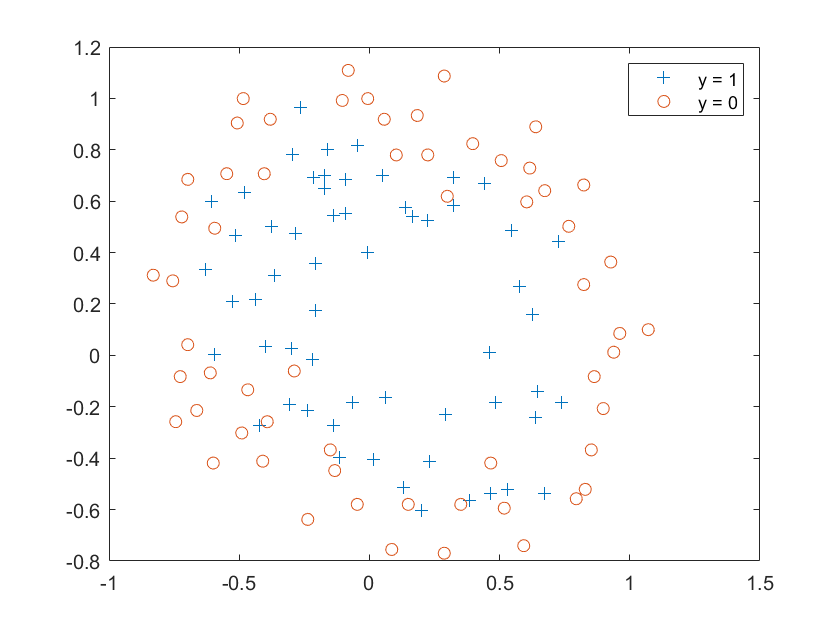

# 1 Linear regression

## 1.0 一些推导

为了加入正则项，则损失函数为：
$$
J(\theta) = \frac{1}{2N}\sum_{i=1}^N(H_\theta(x^{(i)}) - Y^{(i)})^2 + \lambda||\theta||_2^2
$$
求导后：


这里根据推导我们就能看出来，等式右边的后半部分就是普通的批量梯度下降，同时 $\alpha$ 和 $\lambda$ 都是一个**小于1**的比较小的数字，所以这里做的就是在每次迭代的时候，把$\theta_j$ 再缩小一点，*”缩小多少“*这个因子则是由 $\lambda$ 控制的，通过调整 其的大小来**调整**模型是更关注**损失**还是更关注**模型的复杂度**：**小：更关注损失；大：更关注模型的复杂度。**

从最小二乘角度理解：


**注意**

此处$I$矩阵是$(n+1)\times(n+1)$的对角矩阵，但第一项为0，因为不需要对$\theta_0$这一个**偏置项**进行缩放。


$X$矩阵是$m\times(n+1)$的，因为有m个训练样本，每个有$n$个特征，且多了个偏置特征。

## 1.1 导入数据

```matlab
x = load("ex5Data\ex5Linx.dat");
y = load("ex5Data\ex5Liny.dat");
% 绘图
scatter(x, y,'filled','red')
```


## 1.2 变化x

```matlab
x = [ones(m, 1), x, x.^2, x.^3 , x.^4, x.^5]
```


## 1.3 设置$\lambda$


## 1.4 创建$I$


## 1.5 计算$\theta$


## 1.5 绘图

```matlab
xx = -1.0:0.01:1.0;
yy1 = theta1(1,1) + theta1(2, 1)*xx + theta1(3, 1) * xx.^2 + theta1(4, 1) * xx.^3 + theta1(5, 1) * xx.^4 + theta1(6, 1) * xx.^ 5;
yy2 = theta2(1,1) + theta2(2, 1)*xx + theta2(3, 1) * xx.^2 + theta2(4, 1) * xx.^3 + theta2(5, 1) * xx.^4 + theta2(6, 1) * xx.^ 5;
yy3 = theta3(1,1) + theta3(2, 1)*xx + theta3(3, 1) * xx.^2 + theta3(4, 1) * xx.^3 + theta3(5, 1) * xx.^4 + theta3(6, 1) * xx.^ 5;
```

### $\lambda_1 = 0$

```matlab
plot(xx, yy1);
hold on; % 保持图形
grid on;
xold = load('ex5Data\ex5Linx.dat');
scatter(xold, y,'filled');
hold off;legend('Training data', '5th order fit, \lambda_1 = 0');
```


### $\lambda_2 = 1$

```matlab
plot(xx, yy2);
hold on; % 保持图形
grid on;
scatter(xold, y,'filled');
hold off;legend('Training data', '5th order fit, \lambda_2 = 1');
```


### $\lambda_3 = 10$

```matlab
plot(xx, yy3);
hold on; % 保持图形
grid on;
scatter(xold, y,'filled');
hold off;legend('Training data', '5th order fit, \lambda_3 = 10');
```


## 结论

正则向参数$\lambda$ 的值越大，最终得到的曲线就越趋近于直线，也就是其高位所对应的参数值越小。


# 2 Regularized Logistic Regression

## 2.0 一些推导

由参考书得知，我们的$x\in R^{117 \times 28}$，$m = 117$为样例数量，28为特征维数。$y\in R^{117 \times 1}$，$p=28$，为多项式的次幂+1，$h_\theta(x^{(i)})\in R^{1}$ 
$$
h_\theta(x^{(i)}) = \frac{1}{1+e^{-x^{(i)^T} \theta}} \in R^1
$$
其中，$\theta \in R^{28 \times 1}$，$x^{(i)} \in R^{28 \times 1}$ 

则我们可得加了**正则向的损失函数：**
$$
J(\theta) = -\frac{1}{m} \sum_{i=1}^m[y^{(i)}log(h_\theta(x^{(i)})) + (1 - y^{(i)})log(1-h_\theta(x^{(i)}))] + \frac{\lambda}{2m}\sum_{i=1}^p \theta_i^2 \in R^1
$$
写成矩阵形式：
$$
J(\theta)=\frac{1}{m}(-Y^Tlog(h_{\theta}(X))-(1-Y^T)log(1-h_{\theta}(X))) + \frac{\lambda}{2m}\theta^T\theta
$$
**导数**的矩阵形式：
$$
\nabla_{\theta}J=\frac{1}{m}X^T(h_{\theta}(X)-Y) +\frac{\lambda}{m}\theta \in R^{28 \times 1}
$$
其中，$X^T \in R^{28 \times 117}$,$h_\theta(X) - Y \in R^{117 \times 1}$。这里的$h_\theta(X) = \frac{1}{1 + e^{-x\theta}} \in R^{117 \times 1}$ 。

**海森矩阵：**
$$
H(x) = \frac{1}{m}x^Tdiag(h_\theta(x))diag(1-h_\theta(x))x + \frac{\lambda}{m}I \in R^{28\times28}
$$
其中$I的第一项为0，\in R^{28 \times 28}$。

## 2.1 load data

```matlab
x = load('ex5Data\ex5Logx.dat');
y = load('ex5Data\ex5Logy.dat');
figure
pos = find(y);neg = find(y == 0);
plot(x(pos, 1), x(pos, 2), '+')
hold on 
plot(x(neg, 1), x(neg, 2),'o')
legend('y = 1','y = 0')
```



## 2.2 映射

```matlab
% 为x赋值
u = x(:,1);
v = x(:,2);
xold = x;
x = map_feature(u, v)
```


## 2.3 添加$\lambda$


## 2.4 h函数，损失函数的导数，海损矩阵

### 2.4.1 激活函数h

```matlab
function result = h(theta, x)  % h矩阵
    %H theta,x
    t = exp(-x * theta);
    result = 1 ./ (1 + t);
end
```

### 2.4.2 损失函数$J(\theta)$

```matlab
function result = J(x, y, theta, lambda)
%H x, y, theta, lambda
    result = 1/ 117 * (- y' * log(h(theta, x)) - (1 - y') * log(1 - h(theta, x))) + lambda / (2*117) * theta'*theta;
    
%     ans = 0;
%     for i = 1 : 117
%         xi = x(i,:)';
%         ans = ans + (y(i)*log(h2(theta, xi) + 0.00000001) + (1 - y(i)) * log(1 - h2(theta, xi)+ 0.00000001));
%     end 
%     ans = ans * (-1/117);
%     t = 0;
%     for j = 1 : 28
%         t = t + theta(j).^2;
%     end 
%     t = t * lambda / (2 * 117);
%     result = ans + t;
end

```

### 2.4.3 损失函数的导数$\nabla_{\theta}J$

```matlab
function result = Jd(x, y, theta, lambda)
%H x,theta, lambda
%     a = 1 / 117;
%     b = a * x';
%     c = h(theta, x) - y;
%     d = b * c;
    
    result = 1/ 117 * x' * (h(theta, x) - y) +lambda / 117 * theta ;
    
%     m = 117;
%     n = 28; 
%     ans = zeros(n,1);
%     for j = 1 : n
%         for i = 1 : m
%             xi = x(i,:)'; % 28 * 1
%             ans(j) = ans(j) +  (h2(theta, xi) - y(i)) * xi(j) ;
%         end
%         ans(j) = ans(j) / m + lambda / m * theta(j);
%     end
%     result = ans;
end
```

### 2.4.4 海森矩阵

```matlab
function result = hansen(theta, x, lambda)
    t = eye(28);
    t(1,1) = 0;
    result = 1 / 117 * x' * diag(h(theta, x)) * diag(1 - h(theta, x)) * x + lambda / 117 * t;
%     ans = 0;
%     for i = 1:117
%         xi = x(i,:)'; % 28 * 1
%         ans = ans +   xi * xi'* h2(theta,xi) *(1 - h2(theta, xi));
%     end
%     ans = ans / 117;
%     result = ans + lambda / 117 * t;
end
```


## 2.5 发现的错误


这里，要想对每一项求倒数，应该用`./`

同时忘加负号了

正确的：


## 2.6 进行训练

### $\lambda_1 = 0$

```matlab
% 进行训练
epoch_num = 15;
% lambda1
theta1 = zeros(28,1);
xx = 1:1:15;
yy1 = zeros(15,1);
for i = 1 : epoch_num
    loss = J(x, y, theta1, lambda1);
    yy1(i) = loss;
    a = hansen(theta1, x, lambda1);
    t = a \ Jd(x, y, theta1, lambda1);
    theta1 = theta1 - t;
end
```

**绘制loss曲线**


**绘制结果曲线**

```matlab
figure
pos = find(y);neg = find(y == 0);
plot(xold(pos, 1), xold(pos, 2), '+')
hold on ;
plot(xold(neg, 1), xold(neg, 2),'o')
legend('y = 1','y = 0');
% De f ine t h e r ange s o f t h e g r i d
u = linspace ( -1, 1.5 , 200 ) ;
v = linspace ( -1, 1.5 , 200 ) ;
% I n i t i a l i z e s p ace f o r t h e v a l u e s t o be p l o t t e d
z = zeros ( length ( u ) , length ( v ) ) ;
% Ev al u a te z = t h e t a ∗x over t h e g r i d
for i = 1 : length ( u )
    for j = 1 : length ( v )
% N o t ice t h e o r de r o f j , i here !
z ( i , j ) = map_feature( u ( i ) , v ( j ) ) * theta1 ;
    end
end
% Because o f t h e way t h a t c on t our p l o t t i n g works
% in Matlab , we need t o t r a n s p o s e z , or
% e l s e t h e a x i s o r i e n t a t i o n w i l l be f l i p p e d !
z = z';
% Pl o t z = 0 by s p e c i f y i n g t h e range [ 0 , 0 ]
contour ( u , v , z , [ 0 , 0 ] , 'LineWidth' , 2 )
```


### $\lambda_2 = 1$

```matlab
% 训练2
% 进行训练
epoch_num = 15;
% lambda1
theta2 = zeros(28,1);
xx = 1:1:15;
yy2 = zeros(15,1);
for i = 1 : epoch_num
    loss = J(x, y, theta2, lambda2);
    yy2(i) = loss;
    a = hansen(theta2, x, lambda2);
    t = a \ Jd(x, y, theta2, lambda2);
    theta2 = theta2 - t;
end
```

**绘制loss曲线**


**绘制结果曲线**

```matlab
figure
pos = find(y);neg = find(y == 0);
plot(xold(pos, 1), xold(pos, 2), '+')
hold on ;
plot(xold(neg, 1), xold(neg, 2),'o')
legend('y = 1','y = 0');
% De f ine t h e r ange s o f t h e g r i d
u = linspace ( -1, 1.5 , 200 ) ;
v = linspace ( -1, 1.5 , 200 ) ;
% I n i t i a l i z e s p ace f o r t h e v a l u e s t o be p l o t t e d
z = zeros ( length ( u ) , length ( v ) ) ;
% Ev al u a te z = t h e t a ∗x over t h e g r i d
for i = 1 : length ( u )
    for j = 1 : length ( v )
% N o t ice t h e o r de r o f j , i here !
z ( i , j ) = map_feature( u ( i ) , v ( j ) ) * theta2 ;
    end
end
% Because o f t h e way t h a t c on t our p l o t t i n g works
% in Matlab , we need t o t r a n s p o s e z , or
% e l s e t h e a x i s o r i e n t a t i o n w i l l be f l i p p e d !
z = z';
% Pl o t z = 0 by s p e c i f y i n g t h e range [ 0 , 0 ]
contour ( u , v , z , [ 0 , 0 ] , 'LineWidth' , 2 )
```


### $\lambda_3 = 10$

```matlab
% 训练3

% 进行训练
epoch_num = 15;
% lambda1
theta3 = zeros(28,1);
xx = 1:1:15;
yy3 = zeros(15,1);
for i = 1 : epoch_num
    loss = J(x, y, theta3, lambda3);
    yy3(i) = loss;
    a = hansen(theta3, x, lambda3);
    t = a \ Jd(x, y, theta3, lambda3);
    theta3 = theta3 - t;
end
```

**绘制损失曲线**


**绘制结果曲线**

```matlab
figure
pos = find(y);neg = find(y == 0);
plot(xold(pos, 1), xold(pos, 2), '+')
hold on ;
plot(xold(neg, 1), xold(neg, 2),'o')
legend('y = 1','y = 0');
% De f ine t h e r ange s o f t h e g r i d
u = linspace ( -1, 1.5 , 200 ) ;
v = linspace ( -1, 1.5 , 200 ) ;
% I n i t i a l i z e s p ace f o r t h e v a l u e s t o be p l o t t e d
z = zeros ( length ( u ) , length ( v ) ) ;
% Ev al u a te z = t h e t a ∗x over t h e g r i d
for i = 1 : length ( u )
    for j = 1 : length ( v )
% N o t ice t h e o r de r o f j , i here !
z ( i , j ) = map_feature( u ( i ) , v ( j ) ) * theta3 ;
    end
end
% Because o f t h e way t h a t c on t our p l o t t i n g works
% in Matlab , we need t o t r a n s p o s e z , or
% e l s e t h e a x i s o r i e n t a t i o n w i l l be f l i p p e d !
z = z';
% Pl o t z = 0 by s p e c i f y i n g t h e range [ 0 , 0 ]
contour ( u , v , z , [ 0 , 0 ] , 'LineWidth' , 2 )
```


## 2.7 对比$\theta$

我们通过计算不同$\lambda$下$\theta$的范数，来横向比较$\lambda$对$\theta$的影响：


我们可以发现，$\lambda$的值越大，$\theta$的范数就越小，而且结合上文中绘制的训练过程的损失函数可知，$\lambda$越大，loss下降的越快，越早训练好。

因此我们可以得到结论：

$\lambda$越大，$\theta$的范数越小。
